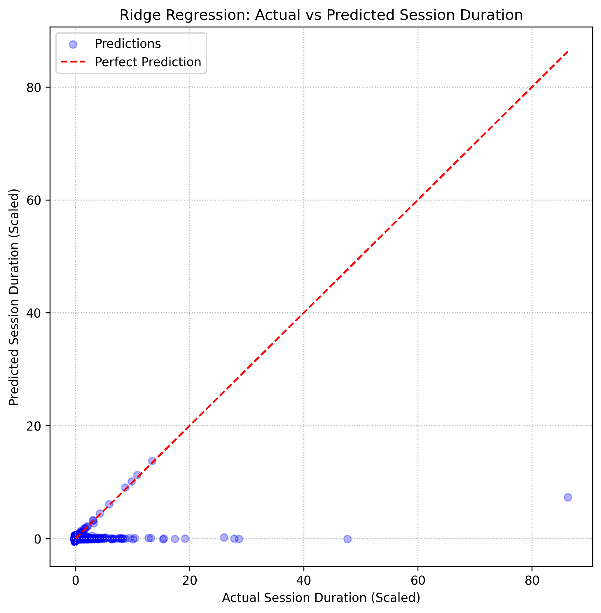
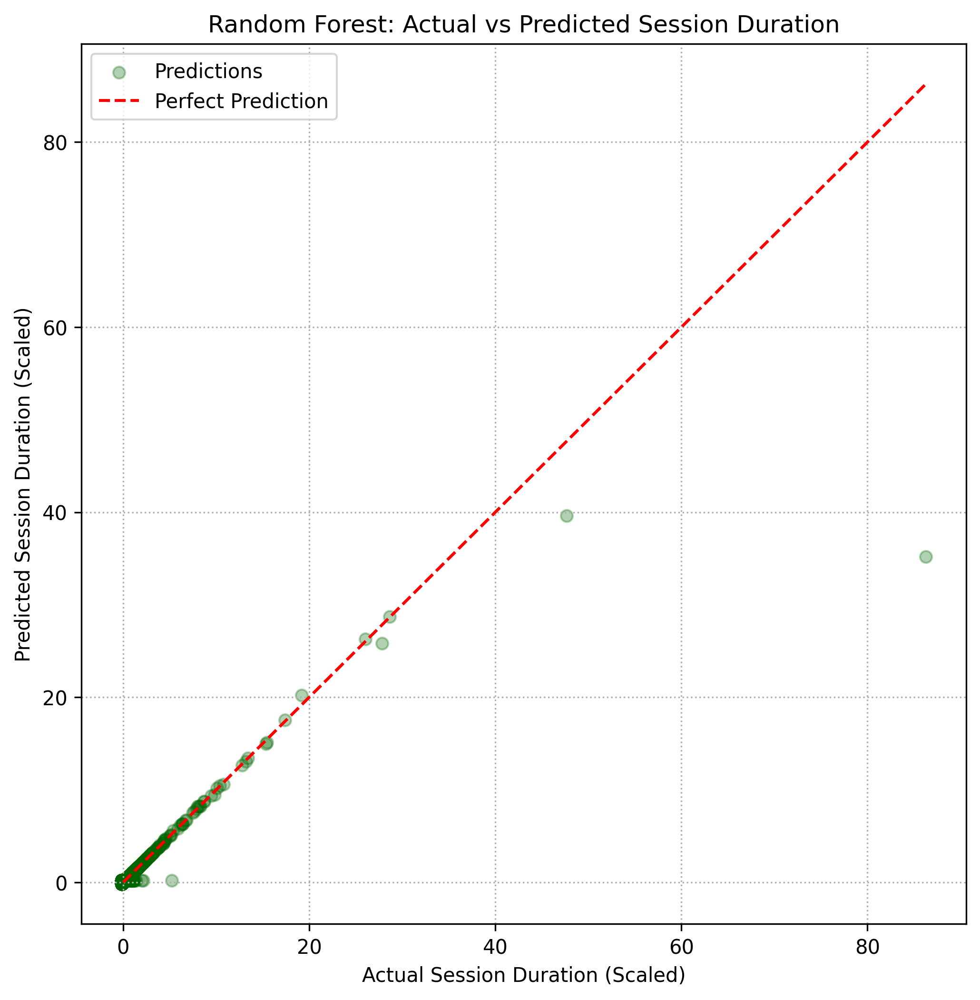
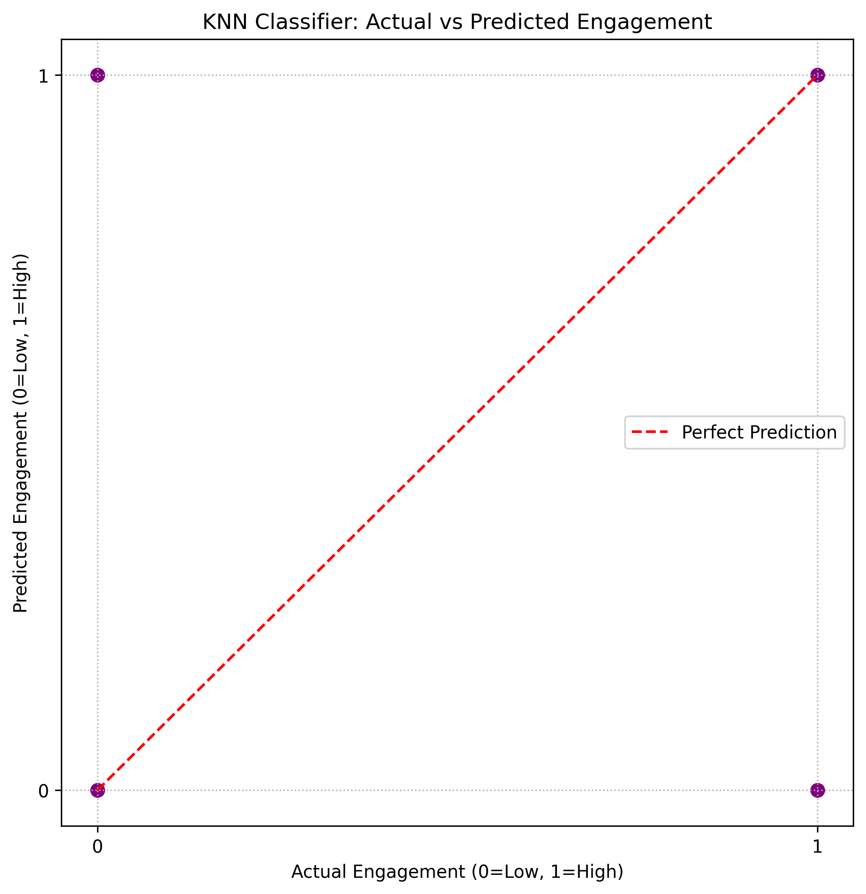
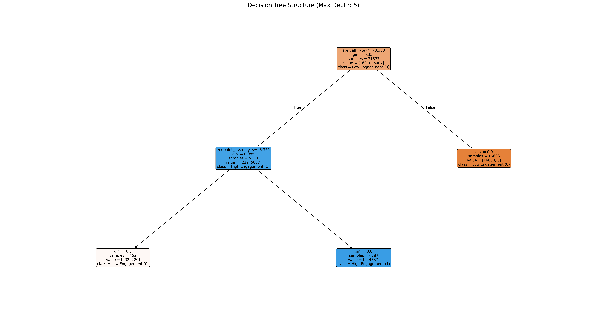
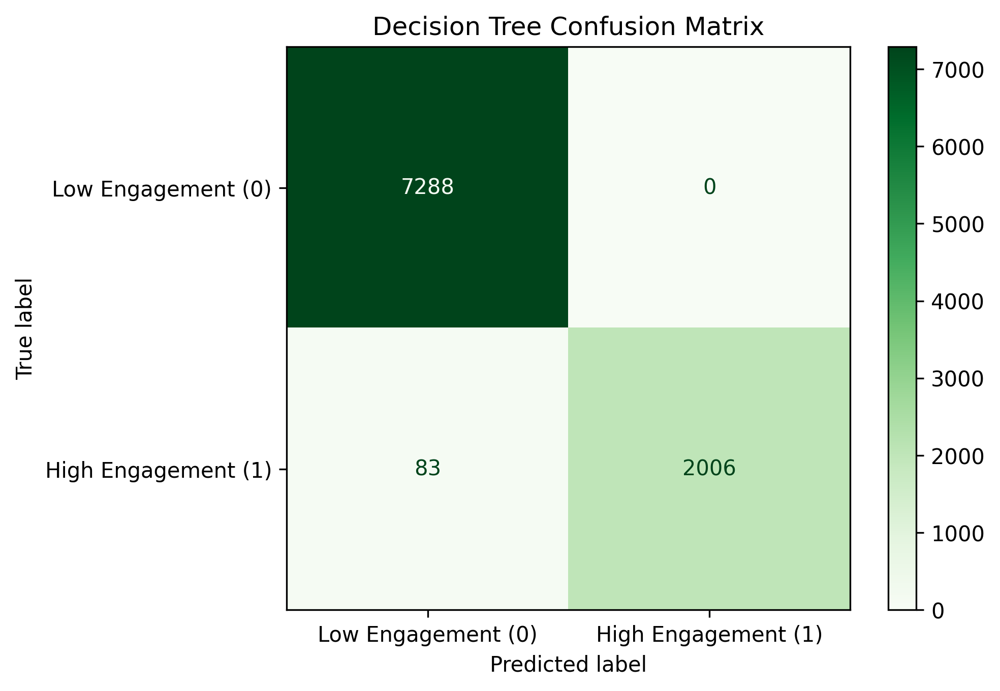
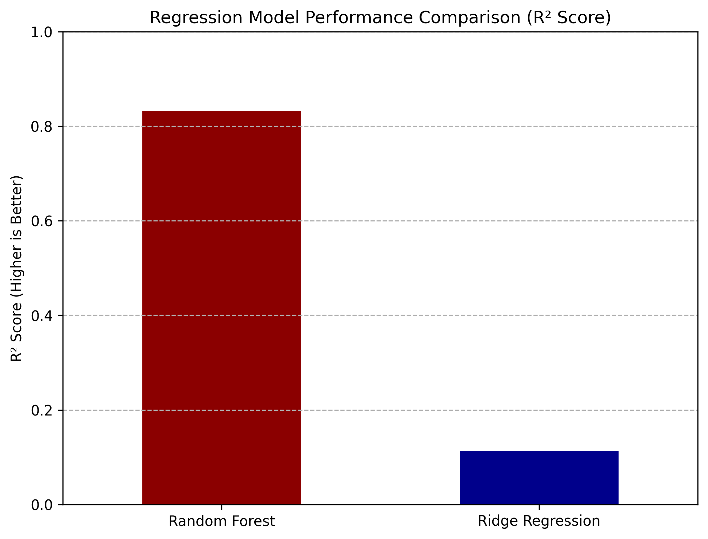
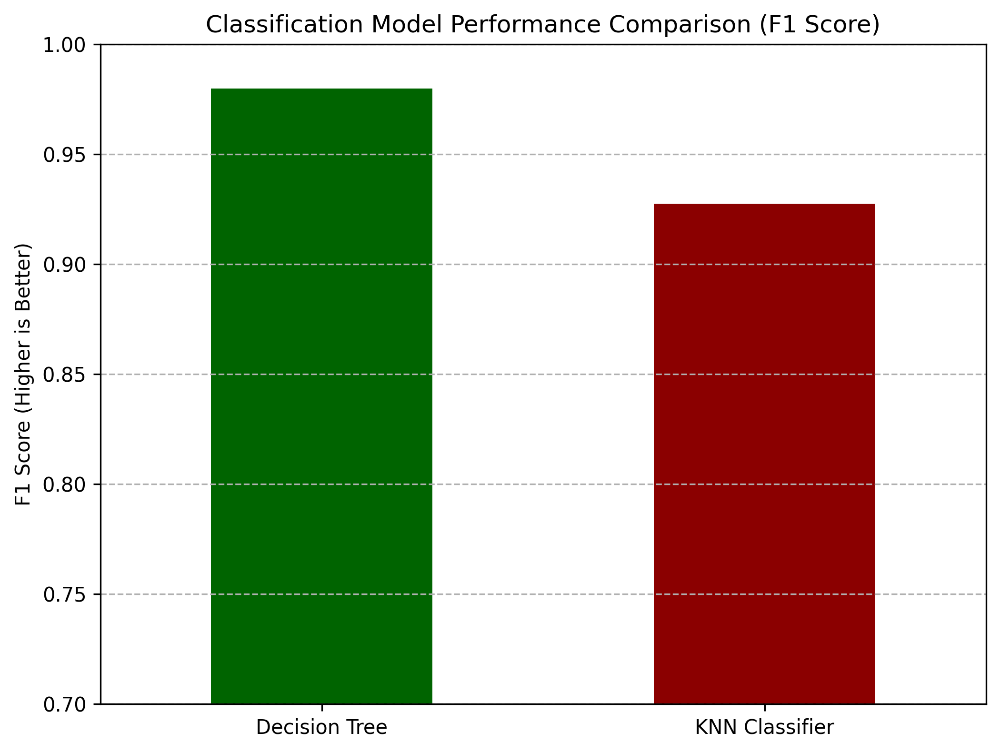

# 📊 Session Data Predictive Analysis Project

A comprehensive machine learning project that analyzes user session data to predict session duration and identify high-engagement sessions using multiple regression and classification models.

---

## 🎯 Project Overview

This project analyzes API log data from user sessions to:
1. **Predict Session Duration** (Regression Task) - How long will a user's session last?
2. **Predict High Engagement** (Classification Task) - Will a user have a highly engaged session (2+ minutes)?

### Key Features
- 🔍 **Data Preprocessing**: Extracts features from raw API logs using regex
- 📈 **Feature Engineering**: Creates session-level features from log-level data
- 🤖 **Multiple ML Models**: Compares 4 different algorithms
- 📊 **Comprehensive Visualizations**: Includes scatter plots, confusion matrices, and model comparisons

---

## 📁 Project Structure

```
Predictive_Project/
│
├── sessions_export.json              # Raw session data (input)
├── jsonfile.py                       # Converts raw logs to JSON format
├── Preprocessing.py                   # Processes JSON and flattens to CSV
├── FinalProcessing.py                 # Main analysis script (feature engineering + ML)
├── sessions_flattened_ready.csv      # Processed data (intermediate)
├── FEATURES_AND_MODELS.md            # Detailed feature and model documentation
└── README.md                         # This file
```

---

## 🚀 Quick Start

### Prerequisites

```bash
pip install pandas numpy scikit-learn matplotlib
```

### Running the Analysis

1. **Convert raw logs to JSON** (if needed):
   ```bash
   python jsonfile.py
   ```

2. **Preprocess and flatten data**:
   ```bash
   python Preprocessing.py
   ```

3. **Run the main analysis**:
   ```bash
   python PredictiveAnalysis.py
   ```

---

## 📊 Data Pipeline

### Step 1: Data Loading
- Loads `sessions_flattened_ready.csv`
- Extracts structured information from log strings using regex
- Converts timestamps to datetime objects

**Output**: Raw log data with parsed components

### Step 2-5: Feature Extraction
- Extracts API path components (resource, function names)
- Separates date and time components
- Calculates session duration
- Cleans up redundant columns

### Step 6-8: Feature Aggregation
- **Groups by session ID** to convert log-level data to session-level features
- Aggregates: API call counts, endpoint diversity, HTTP method counts
- Calculates derived features: call rate, time to first call

### Step 9-11: Feature Encoding & Scaling
- One-hot encodes categorical features
- Scales numerical features using StandardScaler
- Prepares data for machine learning

### Step 12-18: Model Training & Evaluation
- Trains 4 different models
- Evaluates performance with multiple metrics
- Generates visualizations

---

## 🤖 Models Used

### Regression Models (Predict Session Duration)

#### 1. **Ridge Regression** 🔵
- **Type**: Linear model with L2 regularization
- **Best For**: Baseline model, handles many features, prevents overfitting
- **Metrics**: MAE, RMSE, R² Score
- **Visualization**: Scatter plot (Actual vs Predicted) with perfect prediction line

#### 2. **Random Forest Regression** 🟢
- **Type**: Ensemble of decision trees (non-linear)
- **Best For**: Capturing complex patterns, handling non-linear relationships
- **Metrics**: MAE, RMSE, R² Score
- **Visualization**: Scatter plot (Actual vs Predicted) with perfect prediction line

### Classification Models (Predict High Engagement)

#### 3. **KNN Classifier** 🟣
- **Type**: Distance-based classifier
- **Best For**: Simple, interpretable classification
- **Metrics**: Accuracy, Precision, Recall, F1 Score
- **Visualizations**: 
  - Confusion Matrix
  - Scatter plot (Actual vs Predicted)

#### 4. **Decision Tree Classifier** 🟡
- **Type**: Rule-based classifier
- **Best For**: Interpretable rules, feature importance
- **Metrics**: Accuracy, Precision, Recall, F1 Score
- **Visualizations**: 
  - Full Decision Tree Structure
  - Confusion Matrix

---

## 📈 Visualizations Generated

### 1. Ridge Regression: Actual vs Predicted

- **Purpose**: Shows how well Ridge model predicts session duration
- **Interpretation**: Points closer to the red diagonal line = better predictions
- **X-axis**: Actual session duration (scaled)
- **Y-axis**: Predicted session duration (scaled)

### 2. Random Forest: Actual vs Predicted

- **Purpose**: Shows how well Random Forest predicts session duration
- **Interpretation**: Compare with Ridge to see which performs better
- **X-axis**: Actual session duration (scaled)
- **Y-axis**: Predicted session duration (scaled)

### 3. KNN Confusion Matrix

- **Purpose**: Shows classification accuracy breakdown
- **Interpretation**: 
  - Top-left: Correctly predicted Low Engagement
  - Top-right: Incorrectly predicted High (False Positives)
  - Bottom-left: Incorrectly predicted Low (False Negatives)
  - Bottom-right: Correctly predicted High Engagement

### 4. KNN: Actual vs Predicted

- **Purpose**: Shows individual prediction accuracy
- **Interpretation**: Points at (0,0) or (1,1) = correct predictions

### 5. Decision Tree Structure

- **Purpose**: Visualizes the decision rules used by the model
- **Interpretation**: Follow the branches to see how decisions are made
- **Note**: Large visualization showing all decision nodes

### 6. Decision Tree Confusion Matrix

- **Purpose**: Shows Decision Tree classification accuracy
- **Interpretation**: Compare with KNN to see which performs better

### 7. Regression Model Comparison

- **Purpose**: Compares R² scores of Ridge vs Random Forest
- **Interpretation**: Higher bar = better model performance

### 8. Classification Model Comparison

- **Purpose**: Compares F1 scores of KNN vs Decision Tree
- **Interpretation**: Higher bar = better model performance

---

## 📋 Features Used

### Numerical Features
1. **num_api_calls**: Total API calls in session
2. **endpoint_diversity**: Number of unique endpoints accessed
3. **get_count**: Number of GET requests
4. **post_count**: Number of POST requests
5. **api_call_rate**: API calls per second (intensity)
6. **time_to_first_call_sec**: Seconds from session start to first API call
7. **session_duration_sec**: Total session duration (target for regression)

### Categorical Features (One-Hot Encoded)
- **most_frequent_endpoint**: Most commonly used API endpoint
- **most_frequent_resource**: Most commonly used resource (club/event/user)

**Total Features**: ~50-100+ (depends on unique endpoints/resources in data)

For detailed feature documentation, see [FEATURES_AND_MODELS.md](FEATURES_AND_MODELS.md)

---

## 📊 Expected Output

When you run `FinalProcessing.py`, you'll see:

```
🚀 Starting Session Data Analysis Pipeline...

📥 Data Loaded Successfully!
   Shape: 31254 rows × 6 columns
   
   First 5 rows:
   [DataFrame preview]
   
   Data Info:
   [Column information]

📊 Session-Level Features Created!
   Shape: 31254 sessions × 15 features
   
   Feature Summary:
   [Statistical summary]

🔢 Categorical Features Encoded!
   Shape: 31254 sessions × 87 features (after encoding)

✨ Features Scaled and Ready for Modeling!
   Final Dataset Shape: 31254 sessions × 87 features

📦 Regression Data Split Complete!
   Training set: 21877 samples × 81 features
   Test set: 9377 samples × 81 features

🔵 Training Ridge Regression Model...
   MAE: X.XXXX | RMSE: X.XXXX | R²: X.XXXX

🟢 Training Random Forest Regression Model...
   MAE: X.XXXX | RMSE: X.XXXX | R²: X.XXXX

📈 Regression Comparison: Ridge R²=X.XXXX | Random Forest R²=X.XXXX

📦 Classification Data Split Complete!
   Training set: 21877 samples × 81 features
   Test set: 9377 samples × 81 features

🟣 Training KNN Classifier...
   Accuracy: X.XXXX | Precision: X.XXXX | Recall: X.XXXX | F1: X.XXXX

🟡 Training Decision Tree Classifier...
   Accuracy: X.XXXX | Precision: X.XXXX | Recall: X.XXXX | F1: X.XXXX

======================================================================
🎉 ANALYSIS COMPLETE! All models trained and evaluated successfully!
======================================================================
```

Plus 8 visualization windows will open showing the plots described above.

---

## 🛠️ Technical Details

### Data Processing
- **Regex Pattern Matching**: Extracts structured data from log strings
- **Datetime Parsing**: Handles ISO 8601 timestamp format
- **Feature Aggregation**: Groups log-level data to session-level

### Machine Learning
- **Train/Test Split**: 70% training, 30% testing
- **Feature Scaling**: StandardScaler (mean=0, std=1)
- **One-Hot Encoding**: Converts categorical to numerical
- **Random State**: 42 (for reproducibility)

### Model Hyperparameters
- **Ridge Regression**: Default alpha (regularization strength)
- **Random Forest**: 100 trees, parallel processing enabled
- **KNN**: 5 neighbors, parallel processing enabled
- **Decision Tree**: Max depth = 5 (prevents overfitting)

---

## 📚 Additional Resources

- [FEATURES_AND_MODELS.md](FEATURES_AND_MODELS.md) - Detailed feature and model documentation
- [Scikit-learn Documentation](https://scikit-learn.org/) - ML library reference
- [Pandas Documentation](https://pandas.pydata.org/) - Data manipulation reference

---

## 👤 Author

Predictive Analysis Project for MacBease Connections

---

## 📄 License

This project is for educational/analysis purposes.

---

## 🙏 Acknowledgments

- Data provided by MacBease Connections
- Built using Python, pandas, scikit-learn, and matplotlib

---

## 📞 Questions?

For questions about:
- **Code**: Check inline comments in `FinalProcessing.py`
- **Data Pipeline**: Review `Preprocessing.py` and `jsonfile.py`

---

**Happy Analyzing! 🚀📊**

